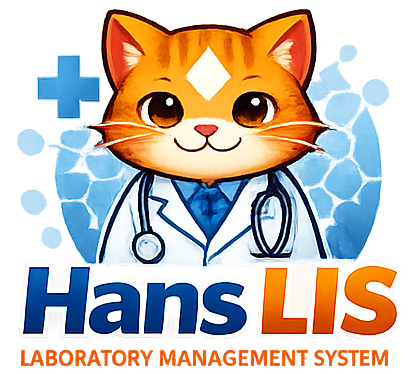
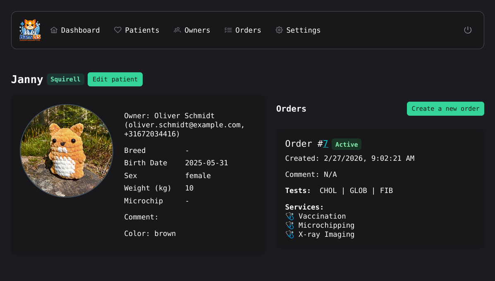
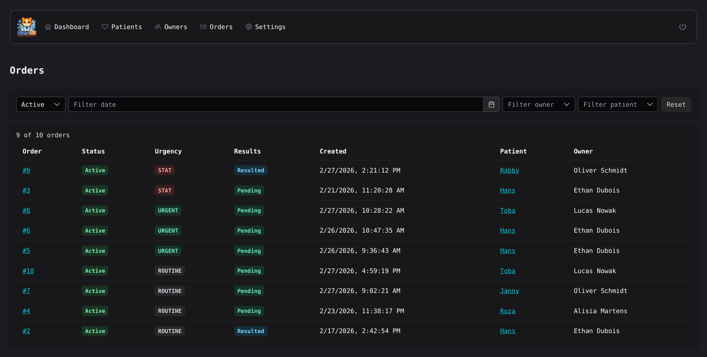
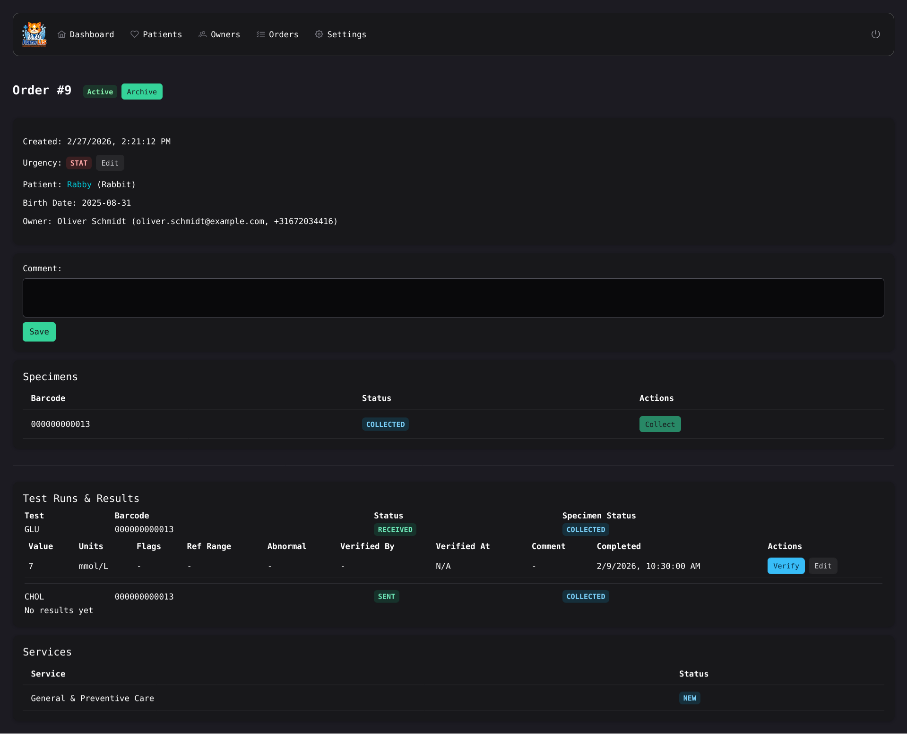
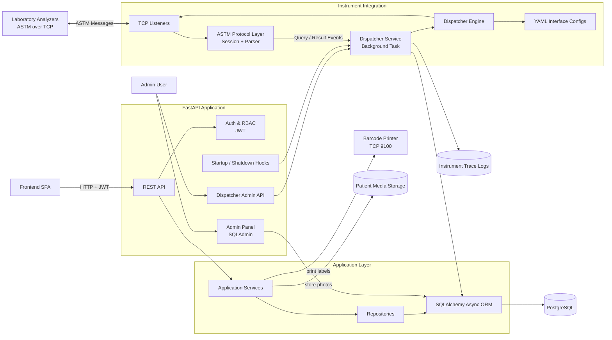
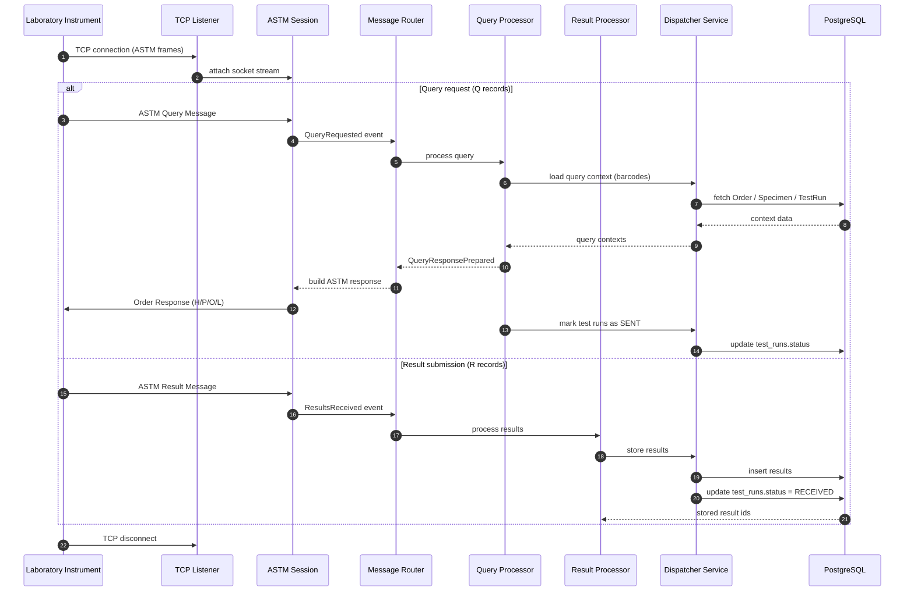
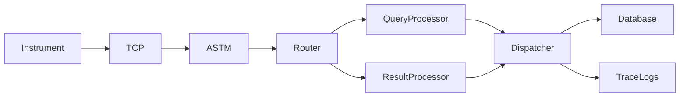
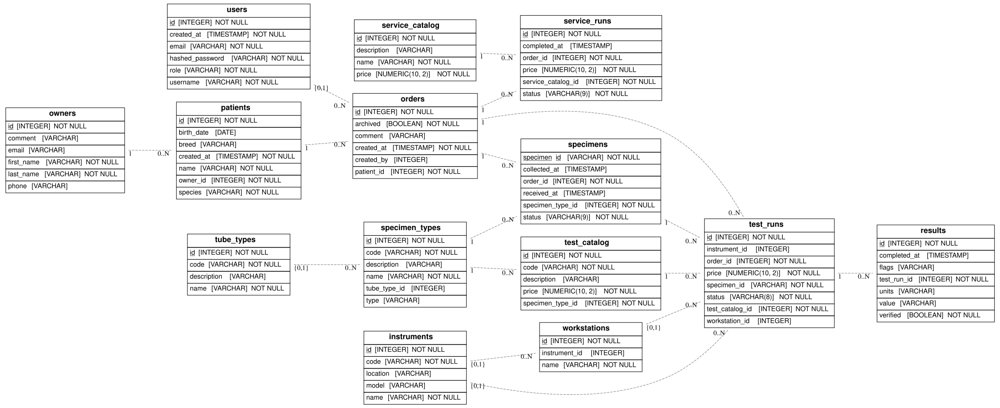

<p align="center">
  
</p>


# Hans LIS

Lightweight veterinary Laboratory Information System (LIS). **The project is under active development.**

## Key Features

### Laboratory Workflow

- Veterinary patient and owner management
- Species-aware patient records
- End-to-end laboratory order lifecycle
- Barcode-based specimen tracking
- Test run tracking from order to result
- Result entry and verification

### Analyzer Integration

- ASTM instrument integration over TCP
- Query/response workflow for test requests
- Automatic analyzer result ingestion
- Instrument and workstation management
- Configurable TCP listeners via dispatcher

### Operations & Administration

- JWT authentication with role-based access control
- Built-in admin panel for data management
- Audit logging of critical user actions
- Patient photo upload and media storage
- Network barcode label printing

<p align="center">
  
</p>
<p align="center">
  
</p>
<p align="center">
  
</p>

<!-- ## Main Functionality

- **Authentication**: JWT-based login, protected endpoints, user roles (admin, staff).
- **CRUD** operations for core entities (owners, patients, specimens, tests, services, orders, results).
- **Orders**: Create orders for a patient with selected tests and services; `/orders/{id}` returns the full order state: specimens, test_runs, service_runs, results.
- **Specimen tracking**: Auto-create runtime specimens (= barcode).
- **Results**: View and update test results (value, units, flags, status, verification); results are stored separately and linked to test_runs (1:N).
- **TCP Server**: LIS listens on multiple configurable ports (from YAML configs) and dispatches incoming messages to protocol handlers.
- **ASTM Handler**: ASTM message handler for query/result processing; accepts R- and Q-records; returns O-records with test lists.
- **Audit logging**: All CRUD operations are recorded in daily audit logs with user ID and timestamp.
- **Instrument Emulator** (debug tool): script for testing ASTM communication without a real analyzer (part of [astmkit](https://github.com/espero451/astmkit)). -->

## Main Technology Stack

### Backend
- Python 3.13+
- FastAPI
- PostgreSQL 16+
- SQLAlchemy 2.0 (async ORM)
- asyncpg (PostgreSQL driver)
- Alembic (migrations)
- Pydantic v2 (schemas and validation)
- python-jose + passlib (JWT authentication and password hashing)
- Uvicorn (ASGI server)
- Python-dotenv (environment variables)

### Frontend
- Vue 3 + Vite
- PrimeVue (UI components)
- Node.js 20+

### Infrastructure & DevOps
- Docker & Docker Compose
- Poetry 2.x (backend dependency management)

## System Architecture



## Message Flow: Instrument -> LIS
<details>
<summary>Show diagram</summary>


</details>

## Instrument Pipeline Diagram



## Database Structure (.svg)

<p align="center">
  
</p>

## Quick Start 

1. Create `.env` in the project root (used by Docker Compose):
```
POSTGRES_USER=hans
POSTGRES_PASSWORD=hans
POSTGRES_DB=hans
SECRET_KEY=your-secret-key
```
2. Build and start containers:
```
docker compose up -d --build
```
3. Apply migrations:
```
docker compose exec backend alembic upgrade head
```
4. Seed admin user:
```
docker compose exec backend python3 -m hans.tools.seed_admin
```
5. Login with username: `hans`, password: `hans`:
```
http://localhost:8080/login
```

### URLs

- Backend: `http://localhost:8000`
- Frontend: `http://localhost:8080`
- Admin UI: `http://localhost:8000/admin` (CRUD management for all database entities)

### Notes

- Docker uses `network_mode: host` for the backend to expose dynamic instrument ports.
  This works only on Linux. For Docker Desktop (macOS/Windows), a different setup
  is required (no host networking).
<!-- - `/.env` is used by Docker Compose for container environment variables. -->
<!-- - `backend/.env` is used for local backend runs (when you start FastAPI directly).
  For local runs, start the backend from the `backend/` directory to ensure the
  correct `.env` is loaded. -->

### Ports

- Postgres is exposed to the host on `5433` (`db` container port `5432`).
- Frontend is exposed on `8080`.
- Instrument interface ports come from YAML configs in
  `backend/src/hans/interfaces/configs` (for example `20100`, `20200`).
  Because `backend` uses `network_mode: host` in Docker, these ports are
  listened on directly by the host with no Docker port mapping.

## Instrument Interfaces

Configuration files live in `backend/src/hans/interfaces/configs`. Each config defines interface name, host, port, and test codes translation.

### Instrument Emulator (astmkit)

You can use [astmkit](https://github.com/espero451/astmkit) to simulate input from instrument.
It sends an ASTM frame over TCP to a target host and prints response frames.

```
astmkit inst input.astm --port 20100
```

Make sure the emulator port matches one of the configured interface ports (`port` in the YAML configs at `backend/src/hans/interfaces/configs`).

### Dispatcher

The dispatcher is a background TCP listener that loads YAML configs, opens
instrument ports, and routes incoming messages to the appropriate protocol
handlers.

Dispatcher starts automatically with the backend.

- Dispatcher status: `GET /settings/dispatcher/status`
- Dispatcher restart: `POST /settings/dispatcher/restart`

## Logs and Traces

- Audit logs: `live/audit/YYYY-MM-DD.log`
- Instrument traces: `live/instruments/<interface>/<YYYY-MM-DD>/`

## Tests

### Run tests in Docker

Run all tests:
```
docker compose exec backend sh -lc "cd /app/backend && PYTHONPATH=src pytest -q"
```

Run a single test file:
```
docker compose exec backend sh -lc "cd /app/backend && PYTHONPATH=src pytest -q tests/unit/test_orders_print_specimen.py"
```

# Roadmap

- Order-level comments for services
- PDF lab reports
- Reference ranges
- Analyzer management UI
- Add more tests


(*In memory of Hans, a cat who was lost and never came back.*)
